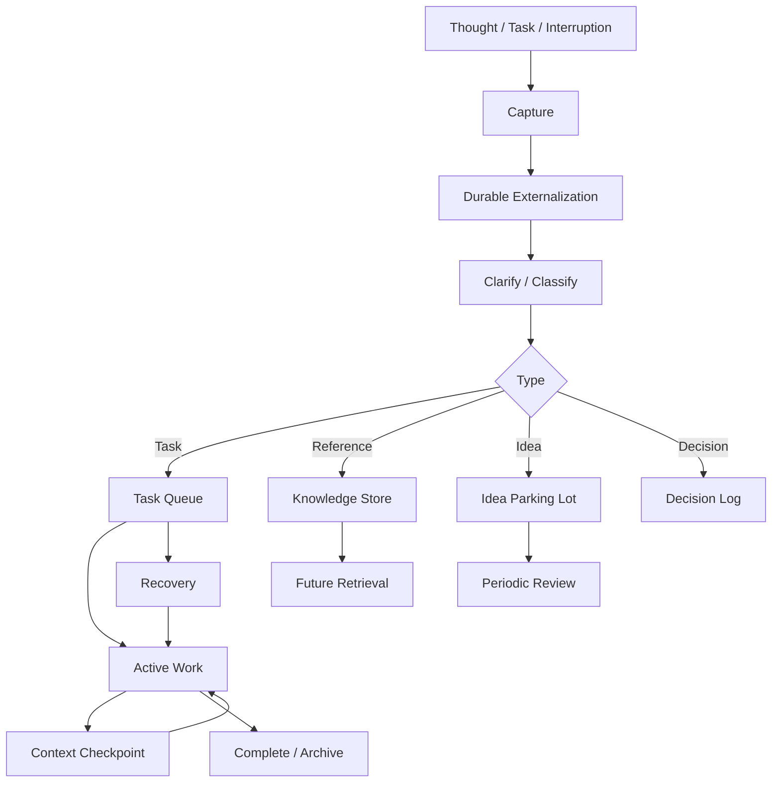

# Cognitive Infrastructure

A practical framework for externalizing cognitive state, reducing working-memory load, preserving context, and recovering from interruptions.

The project uses distributed-systems concepts as **design metaphors** for building a personal system that is easier to capture into, easier to resume, and harder to lose state from. It is ADHD-informed, but is intended to be useful wherever attention, working memory, interruptions, or task initiation create friction.

## Core idea

Do not rely on active cognition to hold everything required for future action.

Instead:

**capture → persist → clarify → route → execute → checkpoint → recover → review**

## Architecture

## Design principles

1. **Externalize state** — move information out of the active cognitive workspace when it does not need to remain there.
2. **Capture before organizing** — the capture path should be faster than the thought can become a competing task.
3. **Persist before processing** — captured information should be safe before it is cleaned up or classified.
4. **Keep active work small** — limit simultaneous execution rather than assuming a fixed biological number of cognitive slots.
5. **Make resumption explicit** — every interruptible task should be recoverable from a compact context packet.
6. **Park, do not suppress** — competing ideas go to a reviewable parking lot rather than becoming active work.
7. **Design for recovery** — missed days, interruptions, and stale tasks are normal operating conditions.
8. **Keep the infrastructure cheap** — the system must not become another project to maintain.

## Repository

- [Cognitive mechanics](docs/01-cognitive-mechanics.md)
- [System architecture](docs/02-system-architecture.md)
- [Core principles](docs/03-core-system-principles.md)
- [Cloud mapping](docs/04-cloud-infrastructure-mapping.md)
- [Workflows and patterns](docs/05-system-workflows-and-patterns.md)
- [Deployment roadmap](docs/06-deployment-roadmap.md)
- [Templates](templates/)
- [Example](examples/project-resumption.md)

## Scope and limitations

This is an engineering-inspired cognitive support framework, not a clinical model or treatment.

Cloud terminology is intentionally metaphorical. AWS services and distributed-systems behavior should not be read as literal descriptions of how the brain works. Individual cognitive profiles vary; the system should be adapted based on observed friction rather than rigid rules.

## License

MIT
