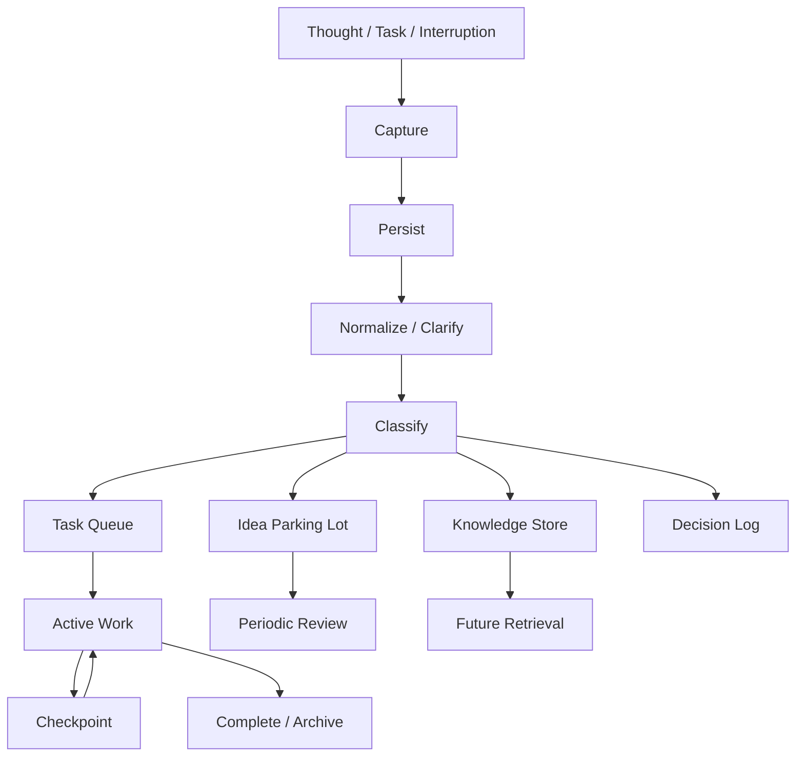

# System Architecture

The architecture separates capture, storage, processing, execution, and recovery so that a thought does not need to remain active in cognition merely because it has not yet been processed.

## Pipeline



## System layers

| Layer | Purpose | Typical implementation |
| --- | --- | --- |
| Capture | Accept thoughts with minimal friction | Quick note, voice note, inbox |
| Persistence | Prevent loss before organization | Notes database, task inbox, file |
| Processing | Clarify and classify | Manual review or automation |
| Task queue | Hold executable work | Task manager / backlog |
| Knowledge store | Hold reference material | Notes / document repository |
| Idea parking lot | Hold non-active ideas | Separate reviewable list |
| Active work | Current execution context | One primary workstream |
| Context checkpoint | Preserve resumption state | Structured note |
| Review | Reconcile queues and stale state | Daily/periodic review |
| Archive | Remove completed or obsolete state | Archive / cold storage |

## State model

```text
CAPTURED
   ↓
PERSISTED
   ↓
CLARIFIED
   ↓
CLASSIFIED
   ├── TASK → QUEUED → ACTIVE → CHECKPOINTED → COMPLETE
   ├── REFERENCE → KNOWLEDGE
   ├── IDEA → PARKED → REVIEWED
   └── DECISION → DECISION LOG
```

## Context packet

The context packet is the key reliability mechanism. It should answer:

> “If I return to this later, what do I need to know to continue without reconstructing the whole task?”

Keep it compact. The system should optimize for **cheap resumption**, not exhaustive documentation.

## Reliability patterns

### Idempotency

Repeated captures should not automatically create repeated work. During review, detect duplicates and merge them where appropriate.

### Rate limiting

Notifications and incoming requests should be limited when they would repeatedly interrupt active work.

### Backpressure

If the capture or review backlog grows beyond what can reasonably be processed, simplify the system and defer nonessential processing. Backlog itself should not become a new source of overload.

### Queue aging

Parked items should be reviewed periodically. Old items can be clarified, scheduled, merged, or archived rather than remaining indefinitely active in the background.

### Checkpointing

Checkpoint frequency should reflect interruption risk and task complexity. There is no universal timer that works for every task.
